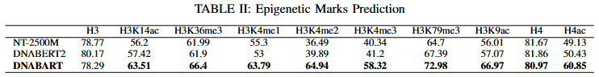

# DNABART: A Genomic LLM Foundational Model for Sequence Correction and Classification

DNABART is a novel encoder-decoder transformer model adapted from BART architecture for genomic sequence analysis. It integrates bidirectional encoding capabilities with autoregressive decoding to enable both accurate sequence interpretation and generation.

## Key Features

- **Encoder-Decoder Architecture**: Leverages modified BART architecture with GELU activations for improved convergence
- **Efficient Tokenization**: Uses Byte-Pair Encoding (BPE) with a vocabulary size of 4096 for optimal genomic sequence representation
- **Robust Pretraining**: Implements denoising autoencoder approach with 30% nucleotide corruption rate
- **State-of-the-Art Performance**: Achieves SOTA results on 16 out of 26 GUE benchmark datasets
- **Resource Efficient**: Competitive performance with only 103M parameters (compared to 2.5B in NT and 117M in DNABERT2)
- Complete report on this work can be found [here](misc/Project_Report_DNABART.pdf)

## Table of Contents
- [Installation](#installation)
- [Pretraining](#pretraining)
- [Finetuning](#finetuning)
- [Acknowledgements](#acknowledgements)


## Installation

### Prerequisites
- Python 3.6+
- CUDA-compatible GPU (tested on V100 and H100)
- Git

### Environment Setup
1. Clone the repository:
   ```bash
   git clone https://github.com/mukund0911/dnabart.git
   cd dnabart
   ```

2. Create and activate a virtual environment:
   ```bash
   python -m venv dnabart_env
   source dnabart_env/bin/activate  # On Windows: dnabart_env\Scripts\activate
   ```

3. Install dependencies:
   ```bash
   pip install -r requirements.txt
   ```

### Weights & Biases Setup
1. Install wandb:
   ```bash
   pip install wandb
   ```

2. Login to your W&B account:
   ```bash
   wandb login
   ```

3. Configure W&B project (automatic during training)

### Directory Structure
Ensure the following directory structure exists:
```
dnabart/
├── checkpoints/
│   └── {corruption_type}/
├── data/
│   └── gue_dataset
│   └── S288C_reference_sequence_R64-5-1_20240529.fsa
├── reference_reads/
│   └── {corruption_type}/
└── trained_models/
    └── {corruption_type}/
```

## Pretraining

### Setup
- Trained on Saccharomyces genome sequences (1M sequences)
- Multiple corruption strategies evaluated:
  - Substitution only
  - Deletion + Insertion
  - Substitution + Deletion + Insertion
- Optimized with AdamW (lr = 1e-4)
- Training: 3 epochs, batch size 5
- Hardware: 3x NVIDIA V100 32GB GPUs
- Total training time: 18 hours

### Data Preparation
1. Download the current release of Saccharomyces Genome Dataset from this [link](http://sgd-archive.yeastgenome.org/sequence/S288C_reference/genome_releases/). 
2. Install wgsim (follow these [instructions](https://github.com/lh3/wgsim)) and generate reference reads as follows. Original `GenerateReads.sh` script includes all three (substitution, deletion, insertion) corruption techniques. If you want to experiment with a single corruption technique, disable the variable in the wgsim command (line 24).
   
   ```bash
   # Make the script executable
   chmod +x GenerateReads.sh
   # Run the script
   ./GenerateReads.sh
   ```

   The above script generates two files: `chr21reads_R1_L150.fastq`, the corrupted genome reference sequences, and `chr21reads_R1_L150_TRUE.fastq`, the true (uncorrupted) sequence. Convert the fastq formats to text files as:

   ```bash
   cat chr21reads_R1_L150.fastq > R1_sequences.txt
   cat chr21reads_R1_L150_TRUE.fastq > R1_true_sequences.txt
   ```

   Save these text files into `reference_reads\{corruption_type}` folder.

3. Prepare tokenizer:
   ```bash
    python tokenizer.py <encoding_type>
    ```

    Command line arguments:
    - `encoding_type`: Type of sequence encoding ['bpe', 'kmer']

4. Pretraining
   ```bash
   python main.py <corruption_type> <encoding_type>

   # Examples:
   # For substitution corruption with BPE encoding
   python main.py sub bpe

   # For insertion-deletion corruption with k-mer encoding
   python main.py indel kmer
   ```

   Command line arguments:
   - `corruption_type`: Type of sequence corruption ['sub', 'indel', 'indelsub']
   - `encoding_type`: Type of sequence encoding ['bpe', 'kmer']
  
   The pretraining process saves the checkpoints at each epoch at `checkpoints\{corruption_type}`, and final trained model as `trained_models\{corruption_type}`. Also, track the model performance on Weights&Biases using the link provided in the terminal before the training starts.

5. Inference
   ```bash
   python inference.py <corruption_type> <encoding_type>
   ```

### Results

Best performance achieved with substitution-only corruption.


## Finetuning

### Setup
- Classification head added:
  - Linear layer
  - ReLU activation
  - 30% dropout
  - Task-specific output layer
- Training parameters:
  - 8 epochs
  - Learning rate: 2e-5
  - Hardware: NVIDIA RTX 4070 12GB GPU
  - Training time: < 30 minutes per dataset

### Datasets
- Genome Understanding and Evaluation (GUE) benchmark (download it from [here](https://drive.google.com/file/d/1GRtbzTe3UXYF1oW27ASNhYX3SZ16D7N2/view?usp=sharing)) 
- 7 tasks spanning 28 distinct datasets
- 26 datasets used for evaluation

### Results
- SOTA achieved on 16 out of 26 datasets
- Improvements of up to 24% on some tasks
- Strong performance on tasks with long-range dependencies
- Notable exception: lower performance on COVID dataset in virus classification task


