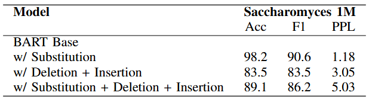

# DNABART: A Genomic LLM Foundational Model for Sequence Correction and Classification

DNABART is a novel encoder-decoder transformer model adapted from BART architecture for genomic sequence analysis. It integrates bidirectional encoding capabilities with autoregressive decoding to enable both accurate sequence interpretation and generation.

## Key Features

- **Encoder-Decoder Architecture**: Leverages modified BART architecture with GELU activations for improved convergence
- **Efficient Tokenization**: Uses Byte-Pair Encoding (BPE) with a vocabulary size of 4096 for optimal genomic sequence representation
- **Robust Pretraining**: Implements denoising autoencoder approach with 30% nucleotide corruption rate
- **State-of-the-Art Performance**: Achieves SOTA results on 16 out of 26 GUE benchmark datasets
- **Resource Efficient**: Competitive performance with only 103M parameters (compared to 2.5B in NT and 117M in DNABERT2)

## Table of Contents
- [Installation](#installation)
- [Pretraining](#pretraining)
- [Finetuning](#finetune)
- [Acknowledgements](#acknowledgements)

## Pretraining

### Setup

- Trained on Saccharomyces genome sequences (1M sequences)
- Multiple corruption strategies evaluated:
  - Substitution only
  - Deletion + Insertion
  - Substitution + Deletion + Insertion
- Optimized with AdamW (lr = 1e-4)
- Training: 3 epochs, batch size 5
- Hardware: 3x NVIDIA V100 32GB GPUs

### Results

Best performance achieved with substitution-only corruption.

